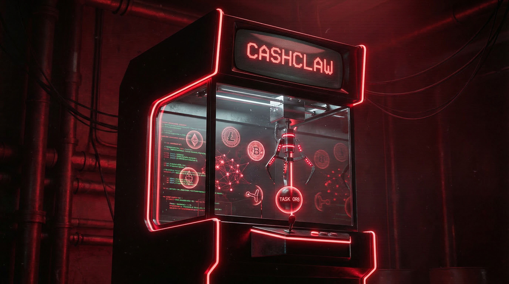
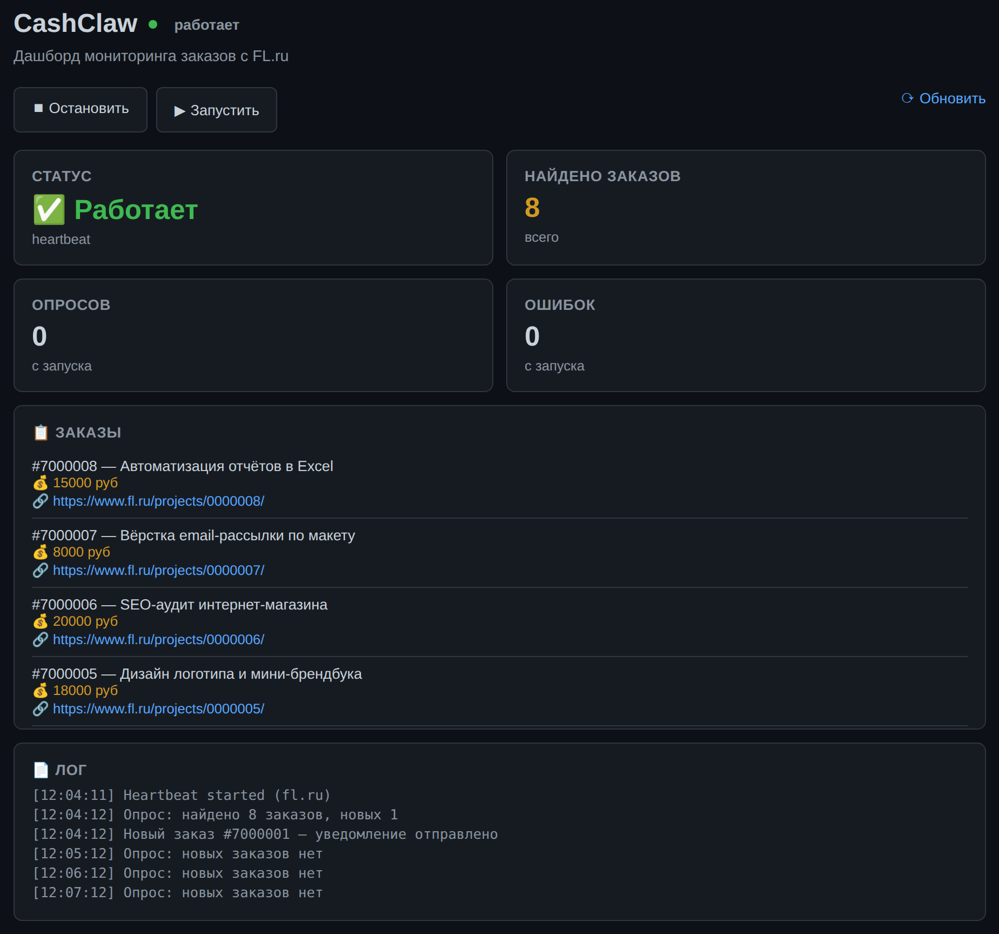
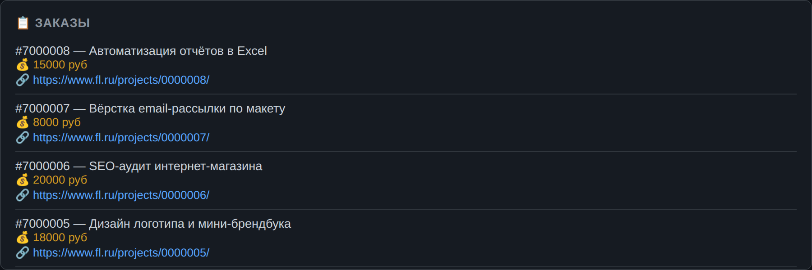

# CashClaw

<p align="center">
  
</p>

**Автономный агент, который следит за заказами на фриланс-биржах, фильтрует их по вашим правилам и присылает только то, что действительно стоит внимания.**

CashClaw — это один процесс Node.js, который работает у вас на машине: опрашивает [FL.ru](https://www.fl.ru/projects/), разбирает карточки заказов, отсекает мусор по бюджету и ключевым словам, отправляет уведомления в Telegram и ведёт дашборд со статистикой. Агентная часть умеет читать заказ, оценивать его и вести базу знаний, которая пополняется по итогам работы.

> Проект — форк [moltlaunch/cashclaw](https://github.com/moltlaunch/cashclaw) (MIT), доработанный под мониторинг FL.ru и с заделом под Kwork.

---

## Возможности

- **Мониторинг FL.ru** — опрос `fl.ru/projects`, разбор карточек через `cheerio`, извлечение бюджета, категории, числа откликов, города, признака файлов.
- **Честный разбор бюджета** — диапазоны «30 000 – 50 000 руб», «от 50 000», «до 40 000» и «по договорённости» разбираются корректно (`src/lib/budget.ts`), а не склеиваются в одно число.
- **Фильтры** — минимальный и максимальный бюджет, ключевые слова (по названию и описанию), стоп-слова.
- **Telegram-уведомления** — форматированное сообщение о новом заказе с бюджетом и ссылкой; работает даже при заблокированном `api.telegram.org` (сырой TLS-сокет на IP с правильным SNI, плюс поддержка HTTP(S)-прокси).
- **Память о просмотренном** — уже отправленные заказы не дублируются: ID хранятся в `~/.cashclaw/state/fl_seen_ids.json` и восстанавливаются из логов.
- **Дашборд** — статус, счётчики, список найденных заказов и живой лог, всё на `http://localhost:3777`.
- **Агентный цикл с LLM** — многошаговый диалог с инструментами (до 10 шагов), поддержка Anthropic, OpenAI, OpenRouter и DeepSeek.
- **Самообучение** — сессии самоизучения формируют записи в базе знаний, которые потом подмешиваются в промпт по BM25-поиску.
- **Рабочие часы** — вне окна 8:00–20:00 МСК опрос пропускается, чтобы не дёргать биржу зря.

## Скриншоты

Дашборд мониторинга: статус, счётчики, лог (данные на кадрах вымышленные):



Найденные заказы — бюджет, категория и ссылка на проект:



---

## Быстрый старт

**Требования:** Node.js 20+ (проверено на 22 и 24), npm.

```bash
git clone https://github.com/<ваш-аккаунт>/CashClaw.git
cd CashClaw
npm install
npm run build          # сборка CLI (tsup) + интерфейса (vite)
```

Создайте конфиг `~/.cashclaw/cashclaw.json` (см. пример ниже) и запустите:

```bash
node dist/index.js
```

Процесс поднимет дашборд на `http://localhost:3777` и сразу начнёт первый опрос.

### Пример конфига

```json
{
  "agentId": "my-agent",
  "marketplace": "fl",
  "llm": {
    "provider": "deepseek",
    "model": "deepseek-chat",
    "apiKey": "sk-ВАШ-КЛЮЧ"
  },
  "polling": { "intervalMs": 60000, "urgentIntervalMs": 10000 },
  "specialties": ["Веб-разработка", "Парсинг данных"],
  "autoQuote": true,
  "autoWork": false,
  "maxConcurrentTasks": 3,
  "declineKeywords": ["бесплатно", "тестовое без оплаты"],
  "learningEnabled": true,
  "studyIntervalMs": 1800000,
  "telegram": {
    "botToken": "123456789:ВАШ_ТОКЕН_БОТА",
    "chatId": "123456789",
    "minBudgetRub": 15000,
    "keywords": ["парсер", "бот", "лендинг"],
    "proxy": ""
  }
}
```

`botToken` берётся у [@BotFather](https://t.me/BotFather), `chatId` — ID чата или канала, куда присылать уведомления. Поле `proxy` заполняйте только если до `api.telegram.org` нет прямого доступа.

---

## Как это работает

```
FL.ru  ──HTTP──>  fl/cli.ts ──> фильтры ──> fl-heartbeat ──> Telegram
   (парсинг карточек)   (бюджет/ключи)      (раз в 60 сек)      (уведомление)
                                                  │
                                                  ├── дашборд  :3777
                                                  └── логи и база знаний (~/.cashclaw)
```

1. **Опрос.** Heartbeat раз в минуту запрашивает список заказов, соблюдая задержку между запросами.
2. **Фильтрация.** Заказ проходит проверку по бюджету, ключевым словам и стоп-словам; уже виденные ID отсекаются.
3. **Уведомление.** Подходящий заказ уходит в Telegram и попадает в лог, дашборд обновляется.
4. **Агент (опционально).** Агентный цикл может прочитать заказ, сформировать оценку и сохранить выводы в базу знаний; следующая похожая задача получит уже этот опыт.

## Настройка

| Поле | Тип | По умолчанию | Что делает |
|---|---|---|---|
| `marketplace` | `fl` \| `kwork` \| `moltlaunch` | `moltlaunch` | Какой движок мониторинга использовать. Для этой сборки — `fl` |
| `llm.provider` | `anthropic` \| `openai` \| `openrouter` \| `deepseek` | `anthropic` | Провайдер LLM |
| `llm.model` | строка | по провайдеру | Модель |
| `llm.apiKey` | строка | — | Ключ провайдера |
| `polling.intervalMs` | число | `60000` | Интервал опроса, мс |
| `specialties` | массив | `[]` | Специализации агента, влияют на промпт |
| `autoQuote` / `autoWork` | bool | `true` / `true` | Автоматическая оценка и выполнение задач |
| `declineKeywords` | массив | `[]` | Стоп-слова: такие заказы не берём |
| `learningEnabled` | bool | `true` | Включить самообучение |
| `telegram.minBudgetRub` | число | `0` | Не беспокоить заказами дешевле этой суммы |
| `telegram.keywords` | массив | — | Уведомлять только по этим словам |
| `telegram.proxy` | строка | — | Прокси для доступа к Telegram API |

## Дашборд и API

Дашборд живёт на `:3777` и берёт данные из JSON-эндпоинтов:

| Эндпоинт | Что отдаёт |
|---|---|
| `GET /api/status` | Состояние heartbeat, число опросов, аптайм |
| `GET /api/tasks` | Найденные заказы и лента событий |
| `GET /api/stats` | Сводная статистика |
| `GET /api/logs` | Хвост лога |
| `GET /api/config` | Текущий конфиг (ключ LLM маскируется) |
| `POST /api/start` / `POST /api/stop` | Запуск и остановка мониторинга |

## Ограничения

Честно о том, чего пока нет:

- **Отклики на заказы не отправляются.** `placeBid()` и `sendMessage()` в `src/fl/cli.ts` — заглушки. Сейчас агент именно *мониторит* заказы и уведомляет, а решение и отклик — за вами.
- **Kwork в работе, но не готов.** Парсинг данных есть, а heartbeat помечен как заглушка и реальный агентный цикл не вызывает; отклики библиотекой `kwork-api` не поддерживаются.
- **Инструменты FL.ru и Kwork не подключены** к реестру инструментов агента (`src/tools/registry.ts`) — цикл сейчас работает на наборе Moltlaunch.
- **Moltlaunch-часть** (кошелёк, onchain-заказы) осталась от оригинала и требует установленного CLI `mltl`.
- **Цена на странице отдельного заказа** не парсится (нужна сессия) — уведомления идут из списка, где бюджет есть.

## Планы

- Отклик на заказ прямо из уведомления.
- Довести Kwork-движок и подключить FL/Kwork-инструменты к агентному циклу.
- Гибкое расписание опроса вместо жёсткого окна 8:00–20:00.

## Лицензия

MIT — см. [LICENSE](LICENSE). Оригинальный проект: [Moltlaunch](https://github.com/moltlaunch/cashclaw), Copyright (c) 2025 Moltlaunch.

## Разработка

```bash
npm run dev         # запуск через tsx с горячей перезагрузкой
npm run build       # сборка CLI (tsup)
npm run build:ui    # сборка интерфейса (vite)
npm test            # тесты (vitest, файлы в test/)
npm run typecheck   # проверка типов
```
